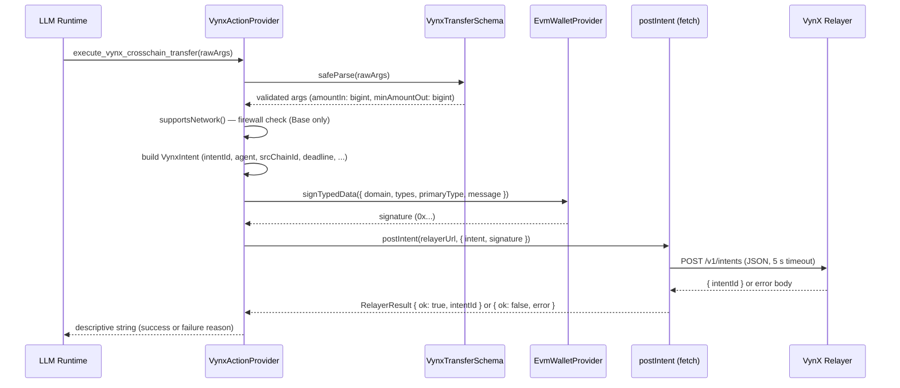

# Architecture

## Overview

The VynX AgentKit Plugin is a stateless, single-responsibility TypeScript module that occupies
exactly one position in the Coinbase AgentKit action graph: it converts a structured LLM parameter
set into a cryptographically signed cross-chain intent and delivers that intent to the VynX
Relayer. No state is persisted between calls. No connection pools, no caches, no queues.

The plugin follows a machine-to-machine (M2M) first philosophy. It is not designed for
human-initiated transactions — it is designed for high-frequency, headless agent pipelines where a
cognitive model produces a routing decision and expects a deterministic, low-latency outcome. Every
design choice — stateless execution, delegated signing, intent abstraction, no on-chain RPC —
exists to serve this constraint.

Custody of the agent's private key is never assumed by this plugin. The `EvmWalletProvider`
abstraction, provided by AgentKit, is the sole signing authority. The plugin calls `signTypedData`
on the injected provider and receives a signature; it never reads, stores, or derives key material
of any kind. This delegation model satisfies institutional custody requirements for autonomous
agent deployments.

## Institutional Trust Model & Delegated Custody

The VynX AgentKit Plugin is engineered as a **Zero-Trust Intermediary**. It is positioned in the
agent execution pipeline precisely because it cannot — by construction — assume custody of any
asset, key, or credential. The plugin observes a structured intent, requests a signature from an
external authority, and forwards the result. It holds nothing.

This model is what makes the plugin deployable inside regulated institutional environments. The
trust boundary lives entirely outside the plugin: signing authority is held by the
**Coinbase Developer Platform (CDP) MPC infrastructure**, which enforces multi-party computation
custody policies, role-based access controls, and operational audit trails at the wallet layer.
The plugin invokes `signTypedData` on the injected `EvmWalletProvider`, and the CDP backend
applies its own institutional approval logic before returning a signature. At no point does the
plugin observe, derive, or persist key material.

The result is a sharp separation of concerns:

| Layer | Authority | Held By |
|---|---|---|
| Intent construction | Cognitive autonomy | The LLM agent |
| Intent validation and standardisation | Protocol logic | This plugin (stateless) |
| Signing authority | Custodial control | Coinbase CDP MPC |
| Settlement execution | Solver competition | VynX Core Protocol Relayer |

Institutions retain complete custodial control over agent funds while granting the cognitive layer
the autonomy required to operate at machine speed. The agent decides *what* to settle; the
institution, through CDP policy, decides *whether* the signature is released. Custody is never
ceded — only delegated under policy.

## Connection to the VynX Core Protocol

This plugin is the **Hot Path Ingress** of the broader VynX Core Protocol. It is the front door
through which all agent-originated intents enter the system, but it is deliberately minimal: its
sole responsibility is to standardise, sign, and forward. Everything that happens after the
`POST /v1/intents` call belongs to the Core Protocol.

The Core Protocol is implemented as a high-frequency **Order Flow Auction (OFA) engine** written
in Go. It ingests signed intents from this plugin, runs them through a competitive solver auction,
selects the optimal execution path, and coordinates cross-chain finality on the destination chain.
The Go engine is optimised for throughput and deterministic latency budgets — concerns that would
be inappropriate to embed in an LLM-facing TypeScript module.

The architectural split is intentional: the TypeScript plugin lives in the cognitive plane,
written for clarity, type safety, and LLM ergonomics; the Go OFA engine lives in the execution
plane, written for raw throughput and matching engine determinism. This plugin is the bridge
between those two planes.

## Data Flow



## Component Responsibilities

| Component | Responsibility | Key Constraint |
|---|---|---|
| `VynxTransferSchema` | Validate and sanitise LLM input parameters | `.strip()` drops unknown keys; `.transform(BigInt)` ensures wei-precision amounts |
| `VynxActionProvider` | Orchestrate validation, signing, and submission | Never throws from the catch block; always returns a `string` to the LLM |
| `EvmWalletProvider` | Sign the EIP-712 structured data payload | Provided by AgentKit; private key never leaves the SDK boundary |
| `postIntent` | Transmit the signed intent to the Relayer | Native `fetch` with `AbortSignal.timeout(5000)`; returns a discriminated union, never throws |
| VynX Relayer | Match intents with solvers and execute cross-chain settlement | Out of scope for this plugin; treated as an opaque REST endpoint |

## EIP-712 Signing

### Domain Separator

```typescript
{
  name: "VynX",
  version: "1",
  chainId: BigInt(srcChainId),        // Base mainnet: 8453n, Base Sepolia: 84532n
  verifyingContract: "0x0000...",     // Deployed Settlement contract on Base
}
```

`chainId` is passed as `BigInt` to ensure parity with the ABI encoder's `uint256` interpretation.
Passing a plain JavaScript `number` risks silent coercion discrepancies in downstream ABI libraries.

### Intent Struct

| Field | Solidity Type | Source |
|---|---|---|
| `intentId` | `bytes32` | `crypto.randomUUID()` padded to 32 bytes |
| `agent` | `address` | `walletProvider.getAddress()` |
| `srcChainId` | `uint256` | `walletProvider.getNetwork().chainId` |
| `destChainId` | `uint256` | LLM parameter |
| `srcToken` | `address` | LLM parameter |
| `destToken` | `address` | LLM parameter |
| `amountIn` | `uint256` | LLM parameter → Zod `BigInt` transform |
| `minAmountOut` | `uint256` | LLM parameter → Zod `BigInt` transform |
| `deadline` | `uint256` | `Math.floor(Date.now() / 1000) + 300` |

### Why BigInt for Amounts

JavaScript's `number` type is an IEEE 754 double-precision float with 53 bits of mantissa. Token
amounts denominated in wei routinely exceed 2^53 (1 ETH = 10^18 wei ≈ 2^60). Passing such values
as `number` silently truncates them, producing an incorrect ABI-encoded hash that the Go Relayer
will reject with `Invalid Signature`. The Zod schema transforms `amountIn` and `minAmountOut` to
`bigint` before they reach `signTypedData`, and the `VynxIntent` HTTP payload re-stringifies them
for JSON-safe transport.

## Security Properties

- **Delegated custody**: the plugin never instantiates a wallet or reads a private key; all signing
  is delegated to the injected `EvmWalletProvider`
- **Zero private-key exposure**: no `PRIVATE_KEY` environment variable exists in this repository;
  `.env.example` contains only Coinbase Developer Platform API credentials used by the consuming
  application
- **Paranoid input validation**: `VynxTransferSchema` uses `.strip()` to drop LLM-injected fields,
  strict regex for EVM addresses (`/^0x[a-fA-F0-9]{40}$/`), and digit-only regex for amounts
  (`/^\d+$/`), rejecting decimals, scientific notation, and hex-encoded values
- **No on-chain RPC calls**: the plugin makes exactly one external network call per intent
  submission — the POST to the Relayer; no blockchain node is queried
- **Network firewall**: `supportsNetwork()` blocks all signing attempts on networks other than
  `base-mainnet` and `base-sepolia`, preventing unintended cross-environment operations
